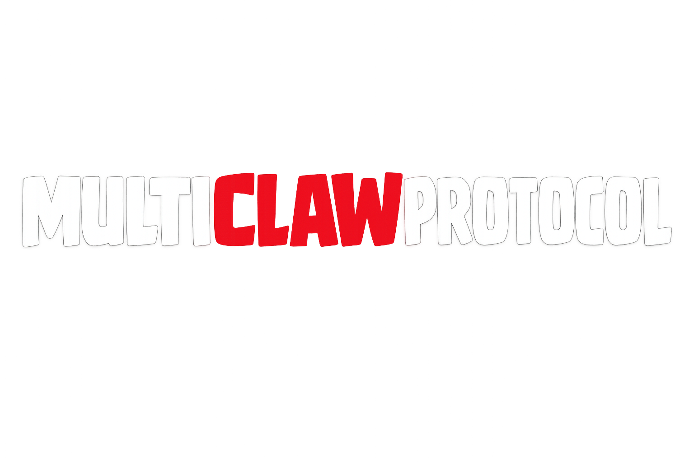
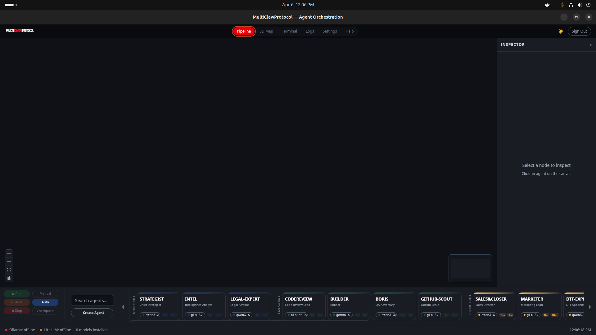
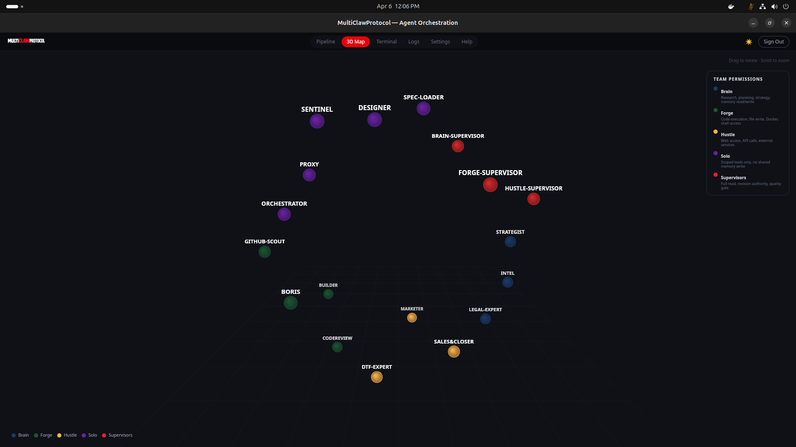
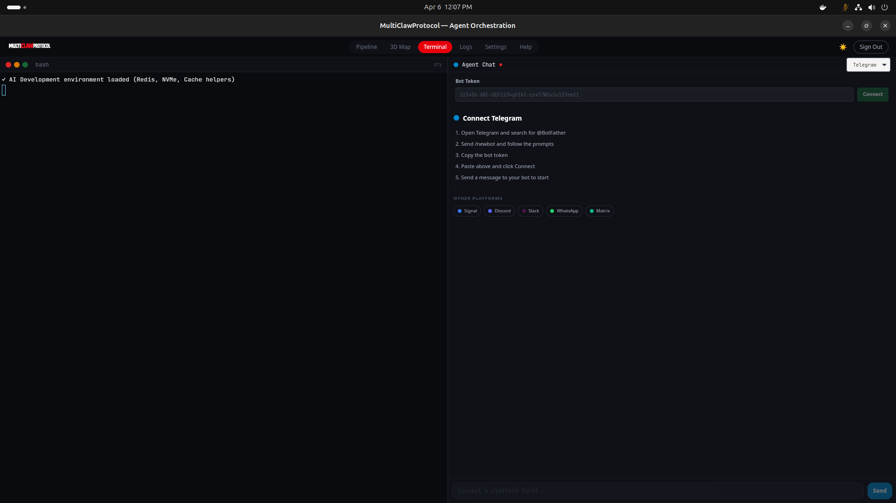
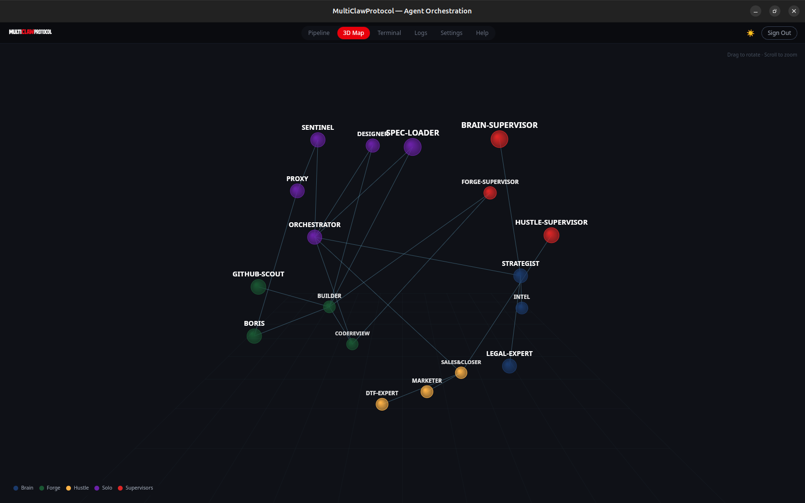
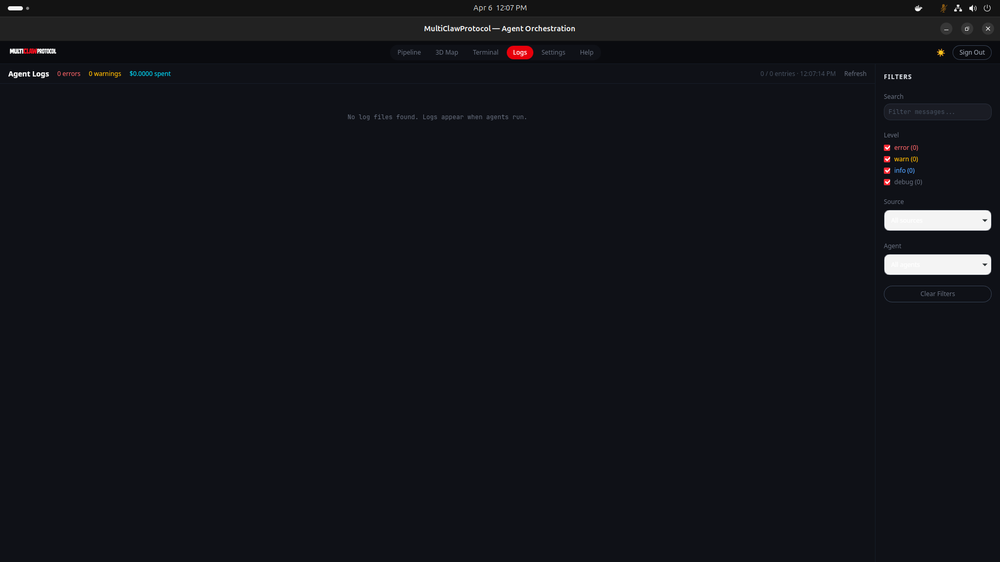
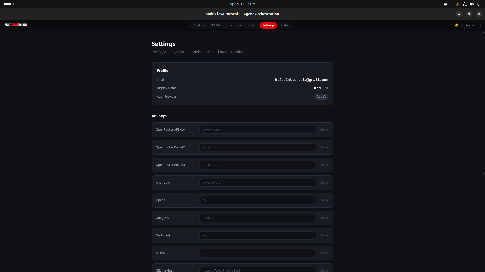
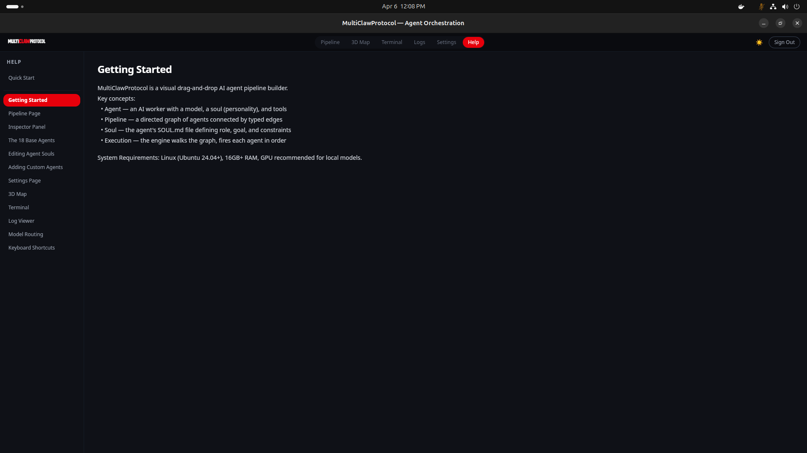

<p align="center">
  
</p>

<p align="center">
  <strong>Visual AI Agent Orchestration Platform</strong><br/>
  Drag-and-drop pipeline builder for 18 autonomous AI agents
</p>

<p align="center">
  
  
  
  
  
  
</p>

---

## Screenshots

| | |
|---|---|
|  |  |
| **Sign In** — Email, GitHub, Google OAuth + T&C | **Dependency Check** — all optional, never blocks |
|  |  |
| **Pipeline Canvas** — drag agents, connect, configure, run | **3D Network** — live agent topology + team permissions |
|  |  |
| **Terminal + Chat** — real bash PTY + Telegram/Signal/Discord | **Log Viewer** — errors, tokens, killswitch, filtered |
|  | |
| **Settings** — API keys, 2FA, models, profile, delete account | |

---

## Features

- **18 pre-built AI agents** across 5 teams (Brain, Forge, Hustle, Solo, Supervisors)
- **Drag-and-drop pipeline canvas** with typed connections and DAG execution
- **Create custom agents** with SOUL.md persona, tools, and model selection
- **3 autonomy modes**: Manual (approve each step), Auto (run all), Checkpoint (resume on crash)
- **Real bash terminal** via PTY — run `claude`, `ollama serve`, any command
- **Connector chat** — Telegram, Signal, Discord, Slack, WhatsApp, Matrix integration
- **3D agent visualization** — interactive network graph with team permissions legend
- **Agent files to disk** — SOUL.md, config.yaml, tools.json at `~/.multiclawprotocol/agents/`
- **ChromaDB integration** — semantic search and agent memory
- **Daily session logs** — rotated log files at `~/.multiclawprotocol/logs/`
- **Health monitoring** — Ollama, LiteLLM, ChromaDB status with smart polling backoff
- **Light + dark mode** with full theme support
- **2FA** via TOTP (Google Authenticator, Authy) — free on all Supabase plans
- **Terms & Conditions** with anonymized telemetry disclosure
- **Account deletion** from Settings
- **GitHub + Google OAuth** sign-in

---

## Quick Start

### 1. Auto-Install (recommended)

```bash
git clone https://github.com/kt2saint-sec/multiclawprotocol.git
cd multiclawprotocol
bash scripts/setup.sh
```

Detects your OS (.deb/.rpm/Arch/openSUSE) and installs: Rust, Node.js, Tauri CLI, ChromaDB, Hermes Agent. Optionally installs Ollama + Docker.

### 2. Run from Source

```bash
npm install
npm run dev          # Vite dev server
```

### 3. Build Desktop App

```bash
cargo tauri build --bundles deb    # .deb package
cargo tauri build                  # .deb + .rpm + .AppImage
```

### 4. Install & Run

```bash
sudo dpkg -i src-tauri/target/release/bundle/deb/MultiClawProtocol_0.1.0_amd64.deb
multiclawprotocol
```

### 5. Configure API Keys (optional)

Go to **Settings** → API Keys. No keys needed for local Ollama models.

| Provider | Models | Cost |
|----------|--------|------|
| OpenRouter | Qwen, Gemma, DeepSeek, GLM | $0–$4/M tokens |
| Anthropic | Claude Sonnet/Opus | $3–$15/M tokens |
| OpenAI | GPT-4o | Varies |
| Ollama (local) | Any model | Free |

---

## How It Works

### Building a Pipeline

1. **Drag** agents from the bottom palette onto the canvas
2. **Connect** them: green handle (output) → blue handle (input)
3. **Configure**: click a node → Inspector opens (model, soul, tools)
4. **Run**: click ▶ Run — engine walks the DAG in dependency order

### Agent Souls

Each agent has a `SOUL.md` — role, goal, constraints. Edit in the Inspector's Soul tab. The soul is injected as the system prompt at runtime.

### Autonomy Modes

| Mode | Behavior |
|------|----------|
| **Manual** | Pauses after each agent — you review and choose: pass context or fresh start |
| **Auto** | Runs the full pipeline without stopping |
| **Checkpoint** | Saves state after each node — resume from last checkpoint on crash |

---

## The 18 Base Agents

| Team | Agents | Permissions |
|------|--------|-------------|
| **Brain** (blue) | STRATEGIST, INTEL, LEGAL-EXPERT | Research, planning, memory read/write |
| **Forge** (green) | CODEREVIEW, BUILDER, BORIS, GITHUB-SCOUT | Code execution, file write, Docker, shell |
| **Hustle** (amber) | SALES&CLOSER, MARKETER, DTF-EXPERT | Web access, API calls, external services |
| **Solo** (purple) | ORCHESTRATOR, PROXY, SENTINEL, DESIGNER, SPEC-LOADER | Scoped tools only |
| **Supervisors** (red) | BRAIN-SUP, FORGE-SUP, HUSTLE-SUP | Full read, revision authority, quality gate |

All agents are fully customizable. Create your own with **+ Create Agent**.

---

## Tech Stack

| Layer | Technology |
|-------|-----------|
| Desktop shell | Tauri 2 (Rust + WebView) |
| Frontend | React 19, TypeScript 5.9, Tailwind CSS 4, React Flow 12, Zustand 5 |
| Backend | Rust (tokio, reqwest, rusqlite, portable-pty) |
| Agent runtime | Hermes Agent + ChromaDB |
| Auth | Supabase (email, GitHub, Google, 2FA TOTP) |
| Models | OpenRouter, Anthropic, OpenAI, Google, Ollama |
| Terminal | xterm.js + real PTY via portable-pty |
| Chat | Telegram, Signal, Discord, Slack, WhatsApp, Matrix connectors |

---

## File Structure

```
~/.multiclawprotocol/
  agents/<id>/          # Per-agent: SOUL.md, config.yaml, tools.json, memories/
  checkpoints/          # SQLite checkpoint state for pipeline resume
  chromadb/             # Vector embeddings (4 collections)
  logs/                 # Daily rotating session logs
  memories/             # Global MEMORY.md + USER.md
  pipelines/            # Saved pipeline YAML files
  workspace/            # Agent execution workspace
```

---

## Build Commands

```bash
npm run build         # Frontend (Vite)
npm run typecheck     # TypeScript strict
npm run lint          # ESLint
cargo tauri build     # Full desktop app (.deb, .rpm, .AppImage)
```

---

## License

Apache License 2.0 — Copyright (c) 2026 Karl Toussaint (kt2saint-sec).

See [LICENSE](LICENSE) for full terms. Third-party dependencies in [THIRD-PARTY-LICENSES.md](THIRD-PARTY-LICENSES.md).

Built on [Hermes Agent](https://github.com/NousResearch/hermes-agent) (MIT).
